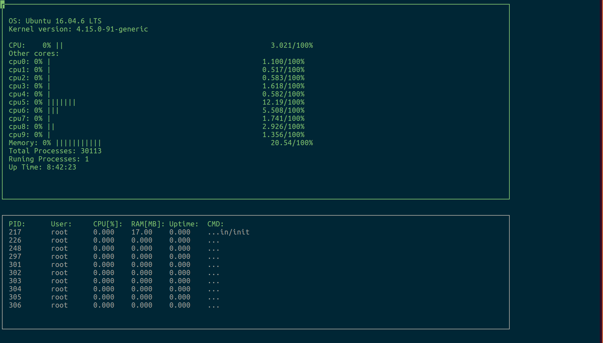

# CPP System Monitor

This is a project from udacity C++ nanodegree program. This program uses ncurses an open-source library to display the information on the terminal. Please note that this program can only be run on a Linux computer. As it is solely design for Linux system. This project demonstrates the Object Oriental Programming with classes.



## Installing dependecies

To build this project correctly, please install the following package.
```sh
sudo apt-get install ncurses-base
```

## Compiling and Running

### Compiling

To compile this project, follow the steps below
```sh
mkdir build && cd build
# From within the `build` directory, then run `cmake` and `make` as follows:
cmake ..
make    # Or `cmake --build .` this is to ignore the maker, whether cmake uses make or other tool it does matter to us
```

### Running

Inside the build directory, run the following command
```sh
./cpp-system-monitor
```